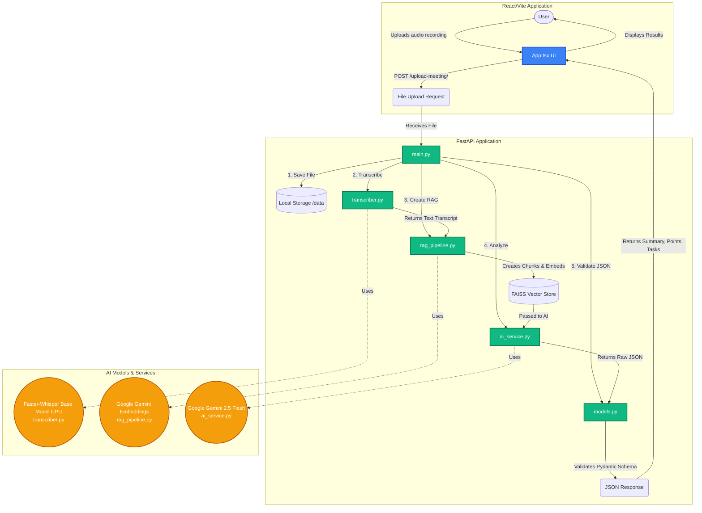

# System Architecture Flow

```mermaid
graph TD
    %% Define Styles
    classDef frontend fill:#3b82f6,stroke:#1d4ed8,stroke-width:2px,color:white
    classDef backend fill:#10b981,stroke:#047857,stroke-width:2px,color:white
    classDef external fill:#f59e0b,stroke:#b45309,stroke-width:2px,color:white

    %% Frontend Components
    subgraph Frontend [React/Vite Application]
        User([User]) -->|Uploads audio recording| App[App.tsx UI]
        App -->|POST /upload-meeting/| API_Req(File Upload Request)
    end
    class App frontend

    %% Backend Components
    subgraph Backend [FastAPI Application]
        API_Req -->|Receives File| MainRouter[main.py]
        
        %% Main execution steps
        MainRouter -->|1. Save File| Filesystem[(Local Storage /data)]
        MainRouter -->|2. Transcribe| Transcriber[transcriber.py]
        MainRouter -->|3. Create RAG| RAG[rag_pipeline.py]
        MainRouter -->|4. Analyze| AIService[ai_service.py]
        MainRouter -->|5. Validate JSON| Models[models.py]
        
        %% Interactions within backend modules
        Transcriber -->|Returns Text Transcript| RAG
        RAG -->|Creates Chunks & Embeds| VectorDB[(FAISS Vector Store)]
        VectorDB -->|Passed to AI| AIService
        AIService -->|Returns Raw JSON| Models
        Models -->|Validates Pydantic Schema| API_Res(JSON Response)
    end
    class MainRouter,Transcriber,RAG,AIService,Models backend

    %% External Services/Models
    subgraph External [AI Models & Services]
        FasterWhisper((Faster-Whisper Base Model CPU\ntranscriber.py))
        GeminiEmbed((Google Gemini Embeddings\nrag_pipeline.py))
        GeminiLLM((Google Gemini 2.5 Flash\nai_service.py))
    end
    class FasterWhisper,GeminiEmbed,GeminiLLM external

    %% Connect Backend to External Models
    Transcriber -.->|Uses| FasterWhisper
    RAG -.->|Uses| GeminiEmbed
    AIService -.->|Uses| GeminiLLM

    %% Final Return Data Flow
    API_Res -->|Returns Summary, Points, Tasks| App
    App -->|Displays Results| User
```
